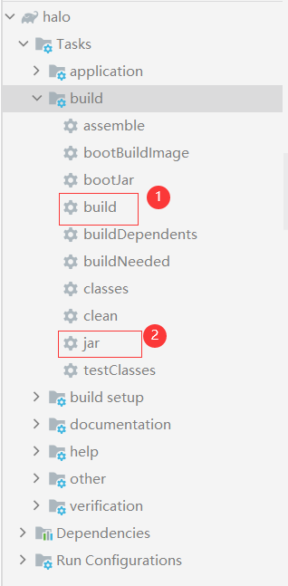

# [bolg](https://github.com/MutiYouth/halo)
This Project forked from [HALO](https://github.com/halo-dev/halo), which is based java and gradle.<br/>
More details you can read at original [readme.md](doc/README.md)、[halo官方文档](https://halo.run/archives/install-quick-start.html).

> Halo 是一款现代化的个人独立博客系统，给习惯写博客的同学多一个选择。<br/>
>本项目旨在创造一个好的产品以供人们使用（虽然现在并不是太好），并非一个所谓提供学习的项目。

## details


## how to use

### compile

使用gradle进行编译，注意不是maven:



### run
后台启动
```cmd
java -jar halo-latest.jar
```

## maintainer
sunlab


## license
MIT

